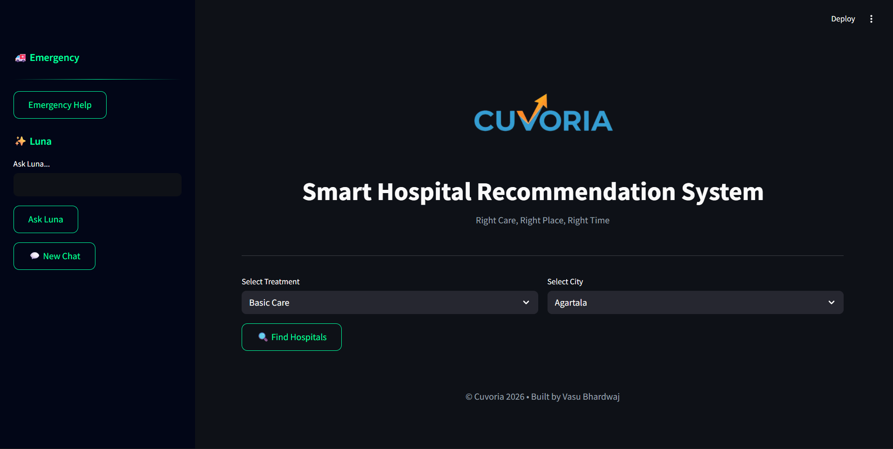
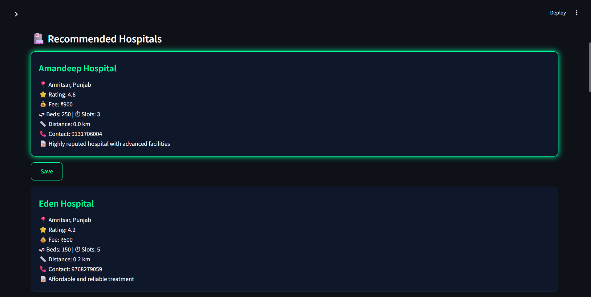
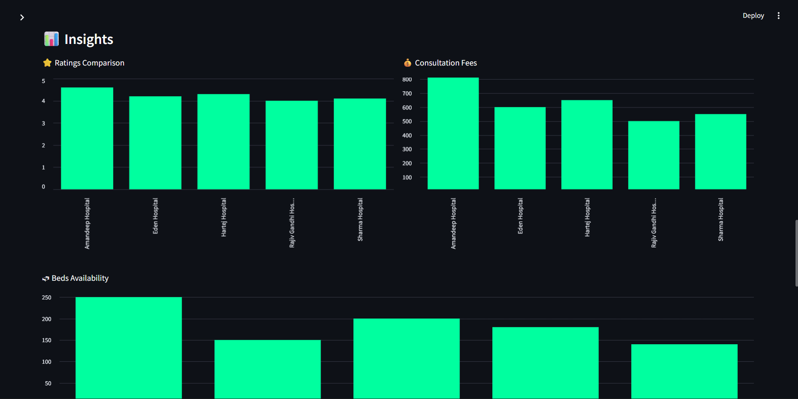
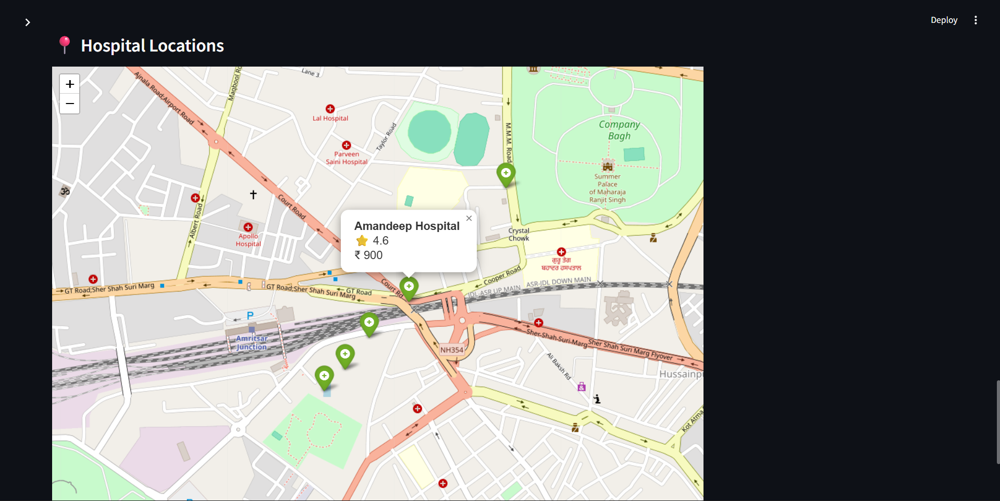
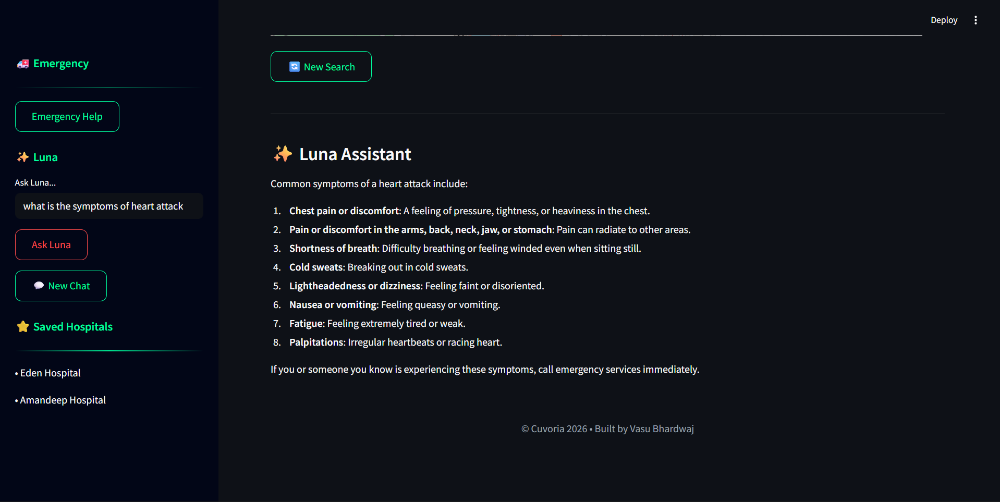

🏥 CUVORIA

SMART HOSPITAL RECOMMENDATION SYSTEM

  <b style="font-size:18px;">Right Care, Right Place, Right Time</b>

---

🧠 Overview

Cuvoria is an intelligent healthcare recommendation platform designed to help users find the most suitable hospitals based on real-world factors such as location, specialization, availability, and ratings.

The system combines data analytics, geospatial intelligence, and AI assistance to deliver fast, accurate, and reliable hospital recommendations.

---

✨ Key Features

- 🏥 Smart hospital recommendations based on user input
- 📍 Distance-based ranking using real geospatial calculations
- ⭐ Hybrid scoring system (rating + distance + availability)
- 📊 Interactive analytics dashboard for insights
- 🗺 Real-time hospital location visualization (Folium map)
- 🤖 Luna AI Assistant for instant health-related queries
- 🚑 Emergency mode for quick nearest hospital access
- 💾 Bookmark system to save preferred hospitals

---

⚙️ Installation & Setup

1️⃣ Clone Repository

git clone https://github.com/your-username/Cuvoria-Smart-Hospital-Recommendation-System.git
cd Cuvoria-Smart-Hospital-Recommendation-System

---

2️⃣ Install Dependencies

pip install -r requirements.txt

---

3️⃣ Configure API Key

Create file:

.streamlit/secrets.toml

Add:

GROQ_API_KEY = "your_api_key_here"

---

4️⃣ Run Application

streamlit run app.py

---

⚡ How It Works

1. Select your city
2. Choose required treatment or specialization
3. Click Find Hospitals
4. View:
   - 📍 Recommended hospitals
   - 📊 Analytical insights
   - 🗺 Interactive map
   - 🤖 AI assistance via Luna

---

📂 Project Structure

Cuvoria/
│
├── app.py
├── cleaned_hospitals.csv
├── logo.png
├── requirements.txt
├── README.md
│
└── assets/
    ├── home.png
    ├── results.png
    ├── insights.png
    ├── map.png
    └── assistant.png

---

📸 Project Screenshots

🏠 Home Interface

  

---

🔍 Hospital Recommendations

  

---

📊 Insights & Analytics

  

---

🗺 Interactive Map

  

---

🤖 Luna AI Assistant

  

---

👨‍💻 Author

Vasu Bhardwaj
BTech CSE | Data Analytics | AI & Cloud Enthusiast

---

📌 Note

This project demonstrates the integration of data analytics, AI, and geospatial intelligence to solve real-world healthcare accessibility challenges.

---

⭐ Support

If you found this project useful, consider giving it a ⭐ on GitHub!

---

  <b>Built with ❤️ by Vasu Bhardwaj</b>

