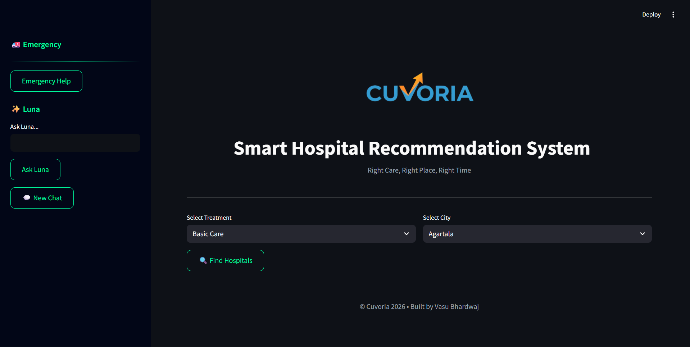
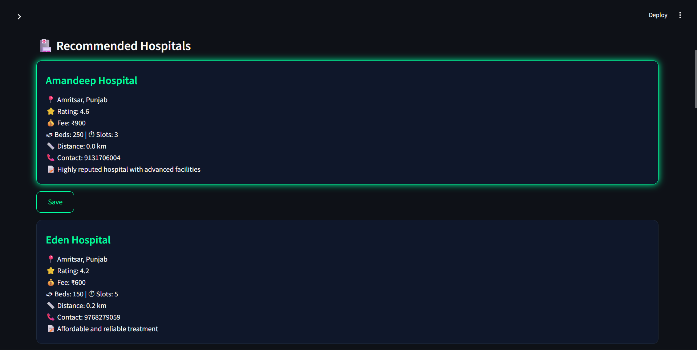
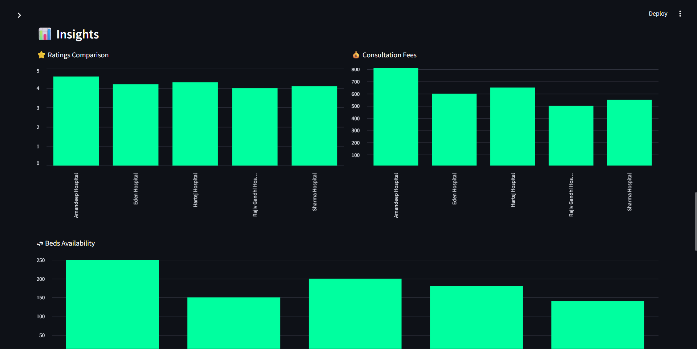
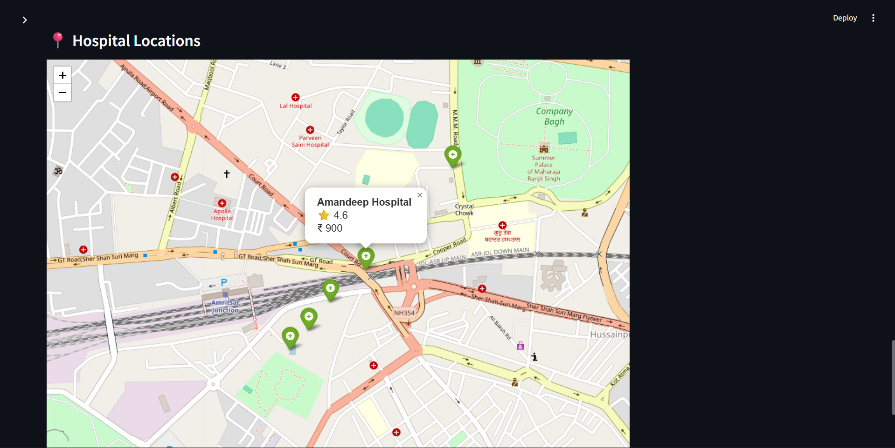
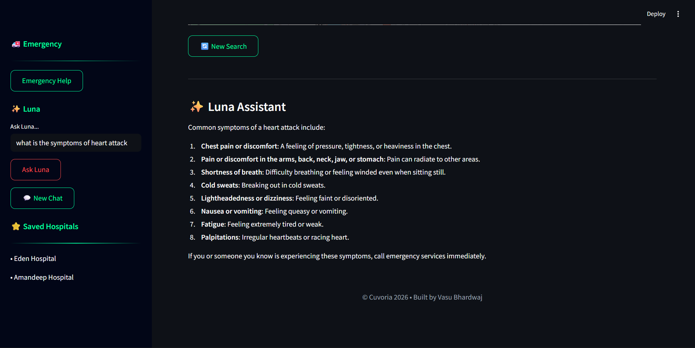

<div align="center">

# 🏥 CUVORIA

## Smart Hospital Recommendation System

### *Right Care, Right Place, Right Time*

<br>


</div>

---
<div align="center">

## 🚀 Try Cuvoria Live

> **Click the button below to launch the application**

[](https://cuvoria-smart-hospital-recommendation-system-nguxauyusvqr9pyxx.streamlit.app)

</div>

# 🧠 Overview

Cuvoria is an intelligent healthcare recommendation platform designed to help users discover the most suitable hospitals using real-world healthcare intelligence.

The system combines:

* 📊 Data Analytics
* 🗺 Geospatial Intelligence
* 🤖 AI-Powered Assistance
* 🏥 Hospital Recommendation Logic

to deliver fast, accurate, and reliable healthcare recommendations.

---

# ✨ Key Features

* 🏥 Smart hospital recommendations based on user requirements
* 📍 Distance-aware ranking using geospatial calculations
* ⭐ Hybrid scoring system using:

  * Ratings
  * Distance
  * Availability
  * Specialization
* 📊 Interactive analytics dashboard
* 🗺 Real-time hospital visualization with Folium maps
* 🤖 Luna AI Assistant for conversational healthcare guidance
* 🚑 Emergency mode for quick nearest-hospital access
* 💾 Save & bookmark preferred hospitals
* 🌙 Modern responsive dark UI

---

# ⚙️ Installation & Setup

## 1️⃣ Clone Repository

```bash
git clone https://github.com/your-username/Cuvoria-Smart-Hospital-Recommendation-System.git

cd Cuvoria-Smart-Hospital-Recommendation-System
```

---

## 2️⃣ Install Dependencies

```bash
pip install -r requirements.txt
```

---

## 3️⃣ Configure API Key

Create:

```bash
.streamlit/secrets.toml
```

Add:

```toml
GROQ_API_KEY = "your_api_key_here"
```

---

## 4️⃣ Run Application

```bash
streamlit run app.py
```

---

# ⚡ How It Works

### Step 1

Select your city

### Step 2

Choose required treatment or specialization

### Step 3

Click **Find Hospitals**

### Step 4

Explore:

* 📍 Recommended Hospitals
* 📊 Insights & Analytics
* 🗺 Interactive Maps
* 🤖 AI Guidance via Luna

---

# 🧠 AI Assistant — Luna

Luna is an intelligent healthcare assistant integrated inside Cuvoria.

### Luna can:

* Recommend hospitals intelligently
* Compare hospitals
* Answer healthcare-related questions
* Suggest hospitals based on specialization
* Provide concise healthcare guidance
* Handle conversational queries naturally

---

# 📂 Project Structure

```bash
Cuvoria/
│
├── app.py
├── cleaned_hospitals.csv
├── logo.png
├── requirements.txt
├── README.md
│
├── assets/
│   ├── home.png
│   ├── results.png
│   ├── insights.png
│   ├── map.png
│   └── assistant.png
│
└── .streamlit/
    └── secrets.toml
```

---

# 📸 Project Screenshots

## 🏠 Home Interface

<p align="center">
  
</p>

---

## 🔍 Hospital Recommendations

<p align="center">
  
</p>

---

## 📊 Insights & Analytics

<p align="center">
  
</p>

---

## 🗺 Interactive Map

<p align="center">
  
</p>

---

## 🤖 Luna AI Assistant

<p align="center">
  
</p>

---

# 🛠 Tech Stack

* Python
* Streamlit
* Pandas
* Folium
* LangChain
* Groq API
* Scikit-learn

---

# 📌 Real-World Use Cases

* Smart healthcare accessibility
* Hospital recommendation systems
* AI-powered healthcare assistants
* Emergency healthcare support
* Geospatial healthcare analytics

---

# 👨‍💻 Author

## Vasu Bhardwaj

Data Analytics • AI • Cloud Computing

---

# ⭐ Support

If you found this project valuable, consider giving it a ⭐ on GitHub.

---

<div align="center">

### Built with ❤️ by Vasu Bhardwaj

</div>
